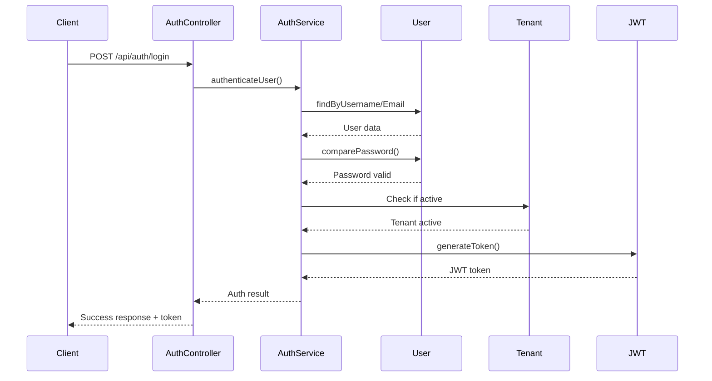
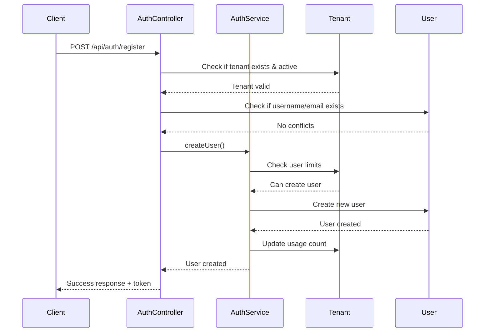

# 🔐 Authentication, User Creation & Permission System

## 📋 Table of Contents
1. [System Overview](#system-overview)
2. [Tenant Architecture](#tenant-architecture)
3. [User Roles & Permissions](#user-roles--permissions)
4. [Authentication Flow](#authentication-flow)
5. [User Creation Process](#user-creation-process)
6. [Permission System](#permission-system)
7. [Security Features](#security-features)
8. [API Endpoints](#api-endpoints)
9. [Examples & Use Cases](#examples--use-cases)
10. [Best Practices](#best-practices)

---

## 🏗️ System Overview

The Toolvio Backend implements a **multi-tenant, role-based access control (RBAC)** system where:

- **Tenants** represent separate organizations/companies
- **Users** belong to specific tenants and have defined roles
- **Permissions** are granular and role-based
- **Data isolation** ensures tenants cannot access each other's data
- **Authentication** uses JWT tokens with tenant context

```
┌─────────────────────────────────────────────────────────────┐
│                    System Architecture                      │
├─────────────────────────────────────────────────────────────┤
│  Super Admin (Platform Level)                              │
│  ├─ Create/Manage Tenants                                  │
│  ├─ Set Subscription Plans                                 │
│  └─ Configure Global Settings                              │
├─────────────────────────────────────────────────────────────┤
│  Tenant A (acme-corp)                                      │
│  ├─ Admin Users (Full Access)                              │
│  ├─ Office Users (Schema Management)                       │
│  ├─ Technician Users (Data Management)                     │
│  └─ Customer Users (Data Read Only)                        │
├─────────────────────────────────────────────────────────────┤
│  Tenant B (tech-startup)                                   │
│  ├─ Admin Users                                            │
│  ├─ Developer Users                                        │
│  └─ Client Users                                           │
└─────────────────────────────────────────────────────────────┘
```

---

## 🏢 Tenant Architecture

### Tenant Model Structure
```javascript
{
  tenantId: "acme-corp",           // Unique identifier
  name: "Acme Corporation",        // Company name
  displayName: "Acme Corp",        // Display name
  description: "Leading tech company",
  
  // Subscription & Limits
  subscriptionPlan: "professional", // trial, basic, professional, enterprise
  settings: {
    maxUsers: 100,                 // Maximum users allowed
    maxSchemas: 50,                // Maximum schemas allowed
    maxStorageGB: 10,              // Maximum storage in GB
    features: {
      auditTrail: true,            // Audit trail enabled
      changeStreams: true,         // Change streams enabled
      offlineSync: true,           // Offline sync enabled
      apiRateLimit: true           // API rate limiting
    }
  },
  
  // Usage Tracking
  usage: {
    userCount: 25,                 // Current user count
    schemaCount: 12,               // Current schema count
    storageUsedGB: 2.5,           // Current storage usage
    apiCallsThisMonth: 1500       // API usage tracking
  },
  
  // Status
  isActive: true,                  // Tenant active status
  isTrial: false,                  // Trial period status
  trialExpiresAt: null,            // Trial expiration
  subscriptionExpiresAt: "2024-12-31" // Subscription end date
}
```

### Tenant Lifecycle
1. **Creation**: Super admin creates tenant with trial plan
2. **Trial Period**: 30-day trial with basic features
3. **Upgrade**: Tenant upgrades to paid plan
4. **Management**: Ongoing usage monitoring and limit enforcement
5. **Deactivation**: Soft delete if tenant becomes inactive

---

## 👥 User Roles & Permissions

### Role Hierarchy
```
Admin (Full Access)
├── Office (Schema Management + Data Access)
├── Technician (Data Management + Read Access)
└── Customer (Data Read Only)
```

### Role Definitions

#### 🔴 **Admin Role**
- **Full access** to all features within tenant
- **User management**: Create, read, update, delete users
- **Schema management**: Full CRUD on schemas
- **Data management**: Full CRUD on all data
- **Audit access**: Read audit logs and perform rollbacks
- **Tenant settings**: Modify tenant configuration

#### 🟠 **Office Role**
- **Schema management**: Read schemas, create/update schemas
- **Data management**: Full CRUD on data
- **Audit access**: Read audit logs (no rollback)
- **User management**: Read user information
- **No schema deletion** or tenant settings access

#### 🟡 **Technician Role**
- **Schema access**: Read schemas only
- **Data management**: Create, read, update data
- **Audit access**: Read audit logs (no rollback)
- **No user management** or schema modification

#### 🟢 **Customer Role**
- **Data access**: Read data only
- **No schema access**
- **No audit access**
- **No user management**

### Permission Matrix
| Resource | Action | Admin | Office | Technician | Customer |
|----------|--------|-------|--------|------------|----------|
| **Schemas** | Read | ✅ | ✅ | ✅ | ❌ |
| **Schemas** | Write | ✅ | ✅ | ❌ | ❌ |
| **Schemas** | Delete | ✅ | ❌ | ❌ | ❌ |
| **Data** | Read | ✅ | ✅ | ✅ | ✅ |
| **Data** | Write | ✅ | ✅ | ✅ | ❌ |
| **Data** | Delete | ✅ | ❌ | ❌ | ❌ |
| **Audit** | Read | ✅ | ✅ | ✅ | ❌ |
| **Audit** | Rollback | ✅ | ❌ | ❌ | ❌ |
| **Users** | Read | ✅ | ✅ | ❌ | ❌ |
| **Users** | Write | ✅ | ❌ | ❌ | ❌ |
| **Users** | Delete | ✅ | ❌ | ❌ | ❌ |

---

## 🔐 Authentication Flow

### 1. User Login Process


### 2. Token Structure
```javascript
// JWT Payload
{
  userId: "507f1f77bcf86cd799439011",
  username: "john.doe",
  email: "john@acme.com",
  role: "technician",
  tenantId: "acme-corp",
  permissions: {
    schemas: { read: true, write: false, delete: false },
    data: { read: true, write: true, delete: false },
    audit: { read: true, rollback: false },
    users: { read: false, write: false, delete: false }
  },
  iat: 1640995200,
  exp: 1641081600,
  issuer: "toolvio-backend",
  audience: "toolvio-app"
}
```

### 3. Authentication Middleware Flow
```javascript
// 1. Extract token from Authorization header
const token = req.headers.authorization.substring(7);

// 2. Verify JWT token
const decoded = AuthService.verifyToken(token);

// 3. Get fresh user data
const user = await User.findById(decoded.userId);

// 4. Verify tenant is active
const tenant = await Tenant.findOne({ tenantId: user.tenantId });

// 5. Set user and tenant context
req.user = { /* user data with permissions */ };
req.tenant = { /* tenant data */ };
```

---

## 👤 User Creation Process

### 1. User Registration Flow


### 2. User Model Structure
```javascript
{
  // Basic Information
  username: "john.doe",
  email: "john@acme.com",
  password: "hashedPassword123",
  firstName: "John",
  lastName: "Doe",
  
  // Role & Tenant
  role: "technician",
  tenantId: "acme-corp",
  
  // Permissions (auto-generated based on role)
  permissions: {
    schemas: { read: true, write: false, delete: false },
    data: { read: true, write: true, delete: false },
    audit: { read: true, rollback: false },
    users: { read: false, write: false, delete: false }
  },
  
  // Status & Security
  isActive: true,
  lastLogin: "2024-01-15T10:30:00Z",
  loginAttempts: 0,
  lockUntil: null
}
```

### 3. User Creation Rules
- **Username/Email**: Must be unique within tenant
- **Password**: Minimum 8 characters, hashed with bcrypt
- **Role Assignment**: Defaults to 'customer' if not specified
- **Tenant Validation**: User can only be created in existing, active tenant
- **Limit Enforcement**: Tenant user limits are enforced
- **Permission Inheritance**: Permissions automatically set based on role

---

## 🛡️ Permission System

### 1. Permission Checking
```javascript
// Check specific permission
if (req.user.permissions.schemas.write) {
  // User can write schemas
}

// Check using helper method
if (req.user.hasPermission('schemas', 'write')) {
  // User can write schemas
}

// Role-based override
if (req.user.role === 'admin') {
  // Admin has all permissions
}
```

### 2. Middleware Usage
```javascript
// Require specific role
router.post('/schemas', 
  authenticate, 
  requireRole(['admin', 'office']), 
  schemaController.createSchema
);

// Require specific permission
router.put('/data/:id', 
  authenticate, 
  authorize('data', 'write'), 
  dataController.updateRecord
);

// Ensure tenant access
router.get('/users', 
  authenticate, 
  requireTenantAccess, 
  userController.getUsers
);
```

### 3. Dynamic Permission Resolution
```javascript
// Get effective permissions based on role
const permissions = user.getEffectivePermissions();

// Result for technician role:
{
  schemas: { read: true, write: false, delete: false },
  data: { read: true, write: true, delete: false },
  audit: { read: true, rollback: false },
  users: { read: false, write: false, delete: false }
}
```

---

## 🔒 Security Features

### 1. Password Security
- **Hashing**: bcrypt with salt rounds
- **Minimum Length**: 8 characters
- **Validation**: Email format validation
- **Brute Force Protection**: Account locking after 5 failed attempts

### 2. Token Security
- **JWT**: JSON Web Tokens with expiration
- **Secret Key**: Environment variable JWT_SECRET
- **Expiration**: Configurable (default: 24 hours)
- **Claims**: User ID, role, tenant, permissions

### 3. Tenant Isolation
- **Data Segregation**: All data queries include tenantId
- **User Isolation**: Users can only access their tenant's data
- **Schema Isolation**: Schemas are tenant-specific
- **Audit Isolation**: Audit logs are tenant-scoped

### 4. Rate Limiting
- **Tenant-based**: Different limits per subscription plan
- **API Endpoints**: Rate limiting on sensitive endpoints
- **User-based**: Individual user rate limiting

---

## 🌐 API Endpoints

### Authentication Endpoints
```
POST /api/auth/login          # User login
POST /api/auth/register       # User registration
POST /api/auth/refresh        # Refresh token
POST /api/auth/logout         # User logout
GET  /api/auth/profile        # Get user profile
PUT  /api/auth/profile        # Update user profile
POST /api/auth/change-password # Change password
GET  /api/auth/tenant         # Get tenant info
GET  /api/auth/validate       # Validate token
```

### Tenant Management Endpoints
```
POST   /api/tenants                    # Create tenant
GET    /api/tenants                    # List all tenants
GET    /api/tenants/summary            # Get tenants summary
GET    /api/tenants/{tenantId}         # Get tenant details
PUT    /api/tenants/{tenantId}         # Update tenant
DELETE /api/tenants/{tenantId}         # Delete tenant
PATCH  /api/tenants/{tenantId}/status  # Toggle tenant status
GET    /api/tenants/{tenantId}/stats   # Get tenant statistics
```

### Schema Management Endpoints
```
GET    /api/schemas                    # List schemas
POST   /api/schemas                    # Create schema
GET    /api/schemas/{name}             # Get schema
PUT    /api/schemas/{name}             # Update schema
DELETE /api/schemas/{name}             # Delete schema
POST   /api/schemas/{name}/reload      # Hot reload schema
GET    /api/schemas/{name}/stats       # Schema statistics
```

### Data Management Endpoints
```
GET    /api/data/{schemaName}          # List records
POST   /api/data/{schemaName}          # Create record
GET    /api/data/{schemaName}/count    # Record count
GET    /api/data/{schemaName}/stats    # Record statistics
GET    /api/data/{schemaName}/search   # Search records
POST   /api/data/{schemaName}/bulk     # Bulk create
GET    /api/data/{schemaName}/{id}     # Get record
PUT    /api/data/{schemaName}/{id}     # Update record
PATCH  /api/data/{schemaName}/{id}     # Patch record
DELETE /api/data/{schemaName}/{id}     # Delete record
```

---

## 📝 Examples & Use Cases

### 1. Creating a New Tenant
```bash
# Super admin creates new tenant
POST /api/tenants
{
  "tenantId": "startup-xyz",
  "name": "Startup XYZ Inc",
  "displayName": "Startup XYZ",
  "description": "Innovative tech startup",
  "subscriptionPlan": "trial"
}
```

### 2. User Registration in Tenant
```bash
# Register first admin user
POST /api/auth/register
{
  "username": "admin.xyz",
  "email": "admin@startup-xyz.com",
  "password": "securePass123",
  "firstName": "Admin",
  "lastName": "User",
  "role": "admin",
  "tenantId": "startup-xyz"
}
```

### 3. User Login
```bash
# User login
POST /api/auth/login
{
  "identifier": "admin.xyz",
  "password": "securePass123",
  "tenantId": "startup-xyz"
}

# Response includes JWT token
{
  "success": true,
  "data": {
    "user": { /* user profile */ },
    "token": "eyJhbGciOiJIUzI1NiIsInR5cCI6IkpXVCJ9..."
  }
}
```

### 4. Creating Schema with Permissions
```bash
# Admin creates schema
POST /api/schemas
Authorization: Bearer <token>
{
  "name": "product",
  "displayName": "Product",
  "description": "Product catalog",
  "jsonSchema": {
    "type": "object",
    "properties": {
      "name": { "type": "string" },
      "price": { "type": "number" }
    }
  }
}
```

### 5. Data Operations
```bash
# Create product record
POST /api/data/product
Authorization: Bearer <token>
{
  "name": "Smartphone",
  "price": 699.99
}

# Read products (filtered by tenant automatically)
GET /api/data/product
Authorization: Bearer <token>
```

---

## ✅ Best Practices

### 1. Security
- **Always validate JWT tokens** before processing requests
- **Check permissions** at both middleware and controller levels
- **Validate tenant access** for all data operations
- **Use HTTPS** in production environments
- **Rotate JWT secrets** regularly

### 2. Performance
- **Index tenantId** on all collections
- **Use database transactions** for multi-step operations
- **Implement caching** for frequently accessed data
- **Monitor API usage** per tenant

### 3. User Management
- **Enforce strong passwords** with validation
- **Implement account locking** for security
- **Regular permission audits** to ensure compliance
- **User activity logging** for audit trails

### 4. Tenant Management
- **Monitor resource usage** to prevent abuse
- **Implement soft deletes** for data retention
- **Backup tenant data** regularly
- **Graceful degradation** when limits are reached

### 5. API Design
- **Consistent error responses** across all endpoints
- **Proper HTTP status codes** for different scenarios
- **Rate limiting** based on subscription plans
- **Comprehensive logging** for debugging

---

## 🔧 Configuration

### Environment Variables
```bash
# JWT Configuration
JWT_SECRET=your-super-secret-key-here
JWT_EXPIRES_IN=24h

# Database
MONGODB_URI=mongodb://localhost:27017/toolvio

# Security
BCRYPT_ROUNDS=12
LOGIN_MAX_ATTEMPTS=5
LOGIN_LOCK_DURATION=2h

# Rate Limiting
RATE_LIMIT_WINDOW=15m
RATE_LIMIT_MAX_REQUESTS=100
```

### Default Settings
```javascript
// Tenant defaults
const defaultTenantSettings = {
  maxUsers: 100,
  maxSchemas: 50,
  maxStorageGB: 10,
  trialDuration: 30, // days
  features: {
    auditTrail: true,
    changeStreams: true,
    offlineSync: true,
    apiRateLimit: true
  }
};

// User defaults
const defaultUserSettings = {
  passwordMinLength: 8,
  maxLoginAttempts: 5,
  lockDuration: 2 * 60 * 60 * 1000, // 2 hours
  sessionTimeout: 24 * 60 * 60 * 1000 // 24 hours
};
```

---

## 📊 Monitoring & Analytics

### Key Metrics to Track
- **User Activity**: Login frequency, session duration
- **API Usage**: Request counts, response times per tenant
- **Resource Usage**: User count, schema count, storage usage
- **Security Events**: Failed logins, permission violations
- **Performance**: Database query times, API response times

### Health Checks
```bash
# System health
GET /api/system/health

# Database statistics
GET /api/system/stats/database

# API usage statistics
GET /api/system/stats/api

# Tenant statistics
GET /api/tenants/{tenantId}/stats
```

---

This comprehensive system provides a robust, secure, and scalable foundation for multi-tenant applications with fine-grained access control and complete data isolation.
